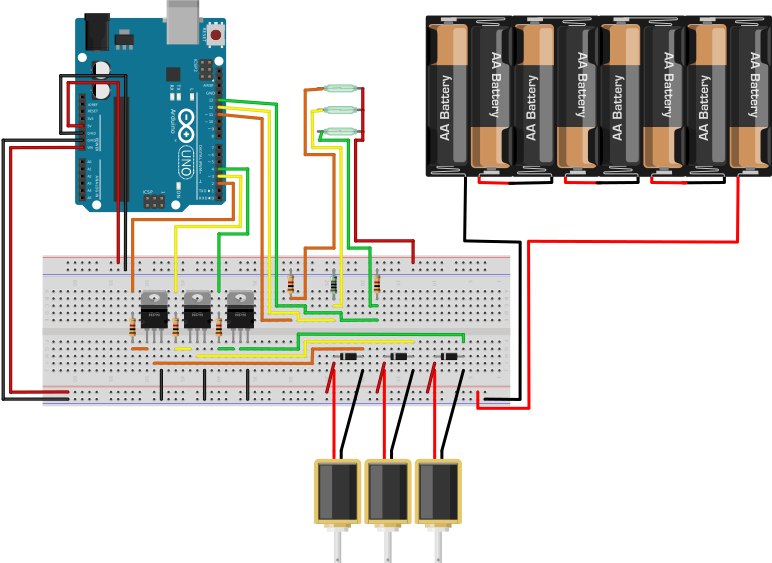

# OpenDispenser

Item list:
* 1x Arduino Uno
* 3x 12v Solvenoid Valve
* 3x NPN Transistor (in my experiment i use TIP120)
* 3x 1N400x Diode (in my experiment i use 1N4001)
* 6x 1K Ohm Resistance
* 1x Membrane button array
